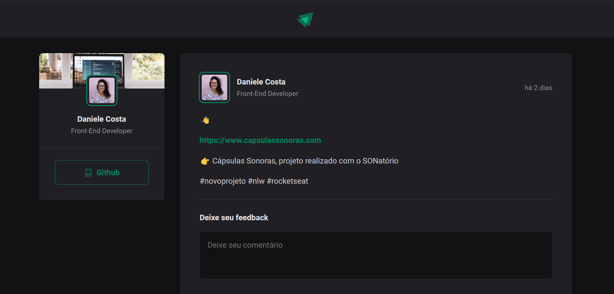

<h1 align="center">Aplicação ReactJS utilizando Vite 🚀</h1>

Programa promovido pela Rocketseat para ensino de tecnologias WEB.  

## 💻 Instalações 

Vite

`npm create vite@latest`

Instalando as dependências

`npm i`

Executando o projeto

`npm run dev`

 Phosphor Icons

`npm i phosphor-react`

 Formatar data 

`npm i date-fns`

